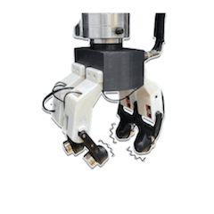

# SonicSense: Object Perception from In-Hand Acoustic Vibration

[Jiaxun Liu](https://www.jiaxunliu.com/), [Boyuan Chen](http://boyuanchen.com/)
<br>
Duke University
<br>

### [Project Website](http://generalroboticslab.com/SonicSense) | [Video](https://www.youtube.com/watch?v=MvSYdLMsvx4) | [Paper](https://arxiv.org/abs/2406.17932)

## Overview
We introduce SonicSense, a holistic design of hardware and software to enable rich robot object perception through in-hand acoustic vibration sensing. While previous studies have shown promising results with acoustic sensing for object perception, current solutions are constrained to a handful of objects with simple geometries and homogeneous materials, single-finger sensing, and mixing training and testing on the same objects. SonicSense enables container inventory status differentiation, heterogeneous material prediction, 3D shape reconstruction, and object re-identification from a diverse set of 83 real-world objects. Our system employs a simple but effective heuristic exploration policy to interact with the objects as well as end-to-end learning-based algorithms to fuse vibration signals to infer object properties. Our framework underscores the significance of in-hand acoustic vibration sensing in advancing robot tactile perception.



## Code Structure

We provide detailed instructions on running our code for [material classification](https://github.com/generalroboticslab/SonicSense/tree/main/ARNet_material_classification), [shape reconstruction](https://github.com/generalroboticslab/SonicSense/tree/main/ARNet_shape_reconstruction) and [object re-identification](https://github.com/generalroboticslab/SonicSense/tree/main/ARNet_object_classification) under each subdirectory. Please refer to specific README files under each directory.

The full CAD model and instruction of our hardware design are under [Hardware_instruction](https://github.com/generalroboticslab/SonicSense/tree/main/Hardware_instruction) subdirectory.

## Citation

If you find our paper or codebase helpful, please consider citing:

```
@article{liu2024sonicsense,
      title={SonicSense: Object Perception from In-Hand Acoustic Vibration}, 
      author={Jiaxun Liu and Boyuan Chen},
      year={2024},
      eprint={2406.17932},
      archivePrefix={arXiv},
      primaryClass={cs.RO},
      url={https://arxiv.org/abs/2406.17932}, 
}
```

## License

This repository is released under the Apache License 2.0. See [LICENSE](LICENSE) for additional details.

## Acknowledgement
[Point Cloud Renderer](https://github.com/zekunhao1995/PointFlowRenderer), [PyLX-16A](https://github.com/ethanlipson/PyLX-16A)
